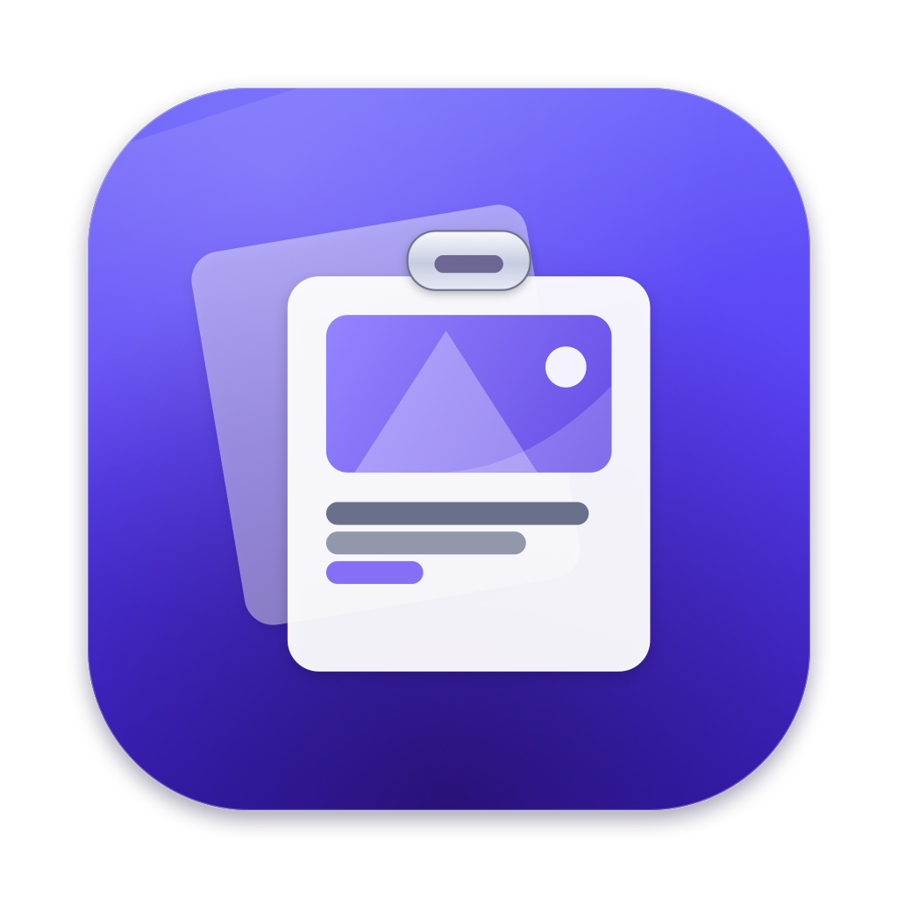

# ClipVault

A native macOS menu-bar clipboard manager. Every piece of text, every image, every file you copy — captured silently, searchable instantly, pasteable anywhere.

**Universal binary · macOS 13 Ventura+ · Intel & Apple Silicon · zero third-party dependencies**



---

## Install

1. Download the newest `ClipVault-<version>.zip` (or `.dmg`) from [Releases](../../releases)
2. Drag **ClipVault** into **Applications**
3. **First launch:** right-click the app → **Open** → **Open**. ClipVault is
   ad-hoc signed, not notarised, so Gatekeeper blocks a plain double-click on a
   downloaded copy. You only do this once. (Equivalent from the terminal:
   `xattr -dr com.apple.quarantine /Applications/ClipVault.app`)
4. A clipboard icon appears in your menu bar. Copy anything — it's already in your history.

> First launch tip: press **⌘⇧V** anywhere to open the panel.
>
> Keep exactly one copy installed, in `/Applications`. Running from elsewhere is
> fine day to day, but macOS only reports a trustworthy launch-at-login state for
> an app it can register from a standard location.

## The 15-second tour

| Action | How |
|---|---|
| Open panel | **⌘⇧V** anywhere, or click the menu-bar icon |
| Search | Just start typing (search is focused automatically) |
| Copy an item back | **Click it** (instant), or select with **↑↓** + **↩** |
| Quick Paste into previous app | Hover the card → 📋 button, or press **⌘↩** |
| Jump-copy top item | **⌘1** … **⌘9** |
| Pin / Unpin | Hover → 📌, or right-click |
| Delete item | Hover → 🗑, or right-click, or **⌘⌫** on selection |
| Filters | `All · Text · Images · Pinned` chips at the top |
| Settings | Gear icon, or right-click the menu-bar icon → Settings |

Right-clicking the menu-bar icon also offers **Quick Paste Last Item** and a **Launch at Login** toggle.

## What it captures

- **Plain text** — with rich-text (HTML/RTF) fidelity preserved when the source provides it, so formatting survives the round-trip
- **Images** — stored losslessly as PNG, with instant thumbnails generated for the list
- **Image files** — copy a `.png` / `.jpg` / `.heic`… from Finder and ClipVault captures the *picture itself*: clicking it pastes the image, not a filename

## What it deliberately ignores

- **Password-manager copies** — 1Password, Bitwarden, KeePassXC and friends mark copies as *concealed* (`org.nspasteboard.ConcealedType`); ClipVault never records them by default. If you disable this guard, captured sensitive items — text *and* images — are shown masked (`••••••••`) in the list; contents stay hidden until copied.
- **Transient copies** — internal app chatter flagged via `org.nspasteboard.TransientType`
- **Apps on your ignore list** — editable in Settings → Security (pre-filled with common password managers)
- **All other files** — documents, folders, multi-file selections are never stored
- Optional: **short numeric codes** (likely OTPs) — off by default so no legitimate copy is ever dropped

## Retention (defaults)

- **Last 200 items** kept (50–1000, configurable)
- **Images auto-purge after 30 days** (7/30/90/365/never, configurable) — pinned images are immune; *Never expire automatically* persists across relaunches
- Pinned items are never evicted by the cap

## Troubleshooting

| Symptom | Fix |
|---|---|
| Launch-at-login toggle looks wrong | macOS only reports a trustworthy state for an app it can register — run ClipVault from `/Applications`. From anywhere else the stored preference is kept as-is rather than being reset. |
| Behaviour seems stale | The footer shows the running version — make sure only `/Applications/ClipVault.app` is installed and relaunch. A second launch while one is running simply opens the panel (single-instance guard). |
| Icon hidden behind the notch | Press ⌘⇧V, double-click the app in Applications, or enable *Show ClipVault in the Dock*. |
| DMG won't build from source | A root-owned `diskimages-helper` can wedge DiskImages; `sudo pkill -9 diskimages-helper` or reboot. The build falls back to a ZIP automatically. |

## Performance notes

- Pasteboard polling is 4×/second with App Nap disabled for the process, so captures are near-instant even when idle.
- Image normalisation (PNG re-encode + thumbnails for large screenshots) runs off the main thread; the panel never blocks on big captures.
- The visible list is memoized per store-revision + query + filter; thumbnails decode once into an LRU cache.

## Privacy

Everything stays on your machine:

```
~/Library/Application Support/ClipVault/
├── manifest.json      # ordered metadata
└── data/              # payloads: <uuid>.txt / .png / .thumb.png / .html / .rtf / .files
```

No network access. No analytics. No accounts. Delete the folder = history gone.

## Permissions (only if you want Quick Paste)

| Permission | Needed for | Grant |
|---|---|---|
| **Accessibility** | Quick Paste (double-click / ⌘↩ pastes into your previous app) | Settings → Advanced → *Grant*, or automatically prompted on first use |

ClipVault uses Accessibility **only** to synthesise a ⌘V keystroke. It never reads other apps' content or your keystrokes. Plain click-to-copy needs **zero** permissions.

## Settings reference

- **General** — Launch at login · Dock icon · ⌘⇧V hotkey on/off · close-panel-after-copy · haptic feedback (ClipVault is silent by design)
- **History** — item cap · image retention · storage usage · purge now · open data folder
- **Security** — concealed-copy guard · sensitive masking · OTP filter · ignored-apps editor
- **Advanced** — Accessibility status · re-show welcome banner · version info

## Versioning & releases

ClipVault follows [Semantic Versioning](https://semver.org). The version lives in
exactly one place — the `VERSION` file at the repo root — and everything else
derives from it:

| Identity | Source | Where it shows up |
|---|---|---|
| Marketing version (`1.0.7`) | `VERSION` | `CFBundleShortVersionString`, panel footer, Settings → Advanced |
| Build number | `git rev-list --count HEAD` | `CFBundleVersion` — monotonic, so macOS never mistakes a newer build for an older one |
| Source commit | `git rev-parse --short HEAD` | `CVSourceCommit` in `Info.plist`, shown in About for bug reports |

Inspect what the current checkout would stamp:

```bash
./Scripts/version.sh
```

**What a bump means**

- **PATCH** — bug fixes and hardening; no behaviour a user relies on changes.
- **MINOR** — new capability or a visible behaviour change that stays compatible
  with existing history and preferences.
- **MAJOR** — a breaking change to the on-disk format (`manifest.json` schema,
  payload layout) or to preference keys, i.e. anything a downgrade can't undo.

Changelog compare/tag links are generated from the `origin` remote; until a
GitHub remote exists they fall back to a visible `OWNER/ClipVault` placeholder
(the two link lines at the bottom of `CHANGELOG.md` are worth a one-time fix
after the repo is created).

**Cutting a release**

1. Describe the change under `## [Unreleased]` in `CHANGELOG.md` as you go.
2. Run the release script — it refuses to start on a dirty tree, with an empty
   `[Unreleased]`, or if the tag already exists:

```bash
./Scripts/release.sh patch --dry-run
```

3. Drop `--dry-run` to write `VERSION`, promote the changelog section, run the
   full build, commit `Release vX.Y.Z`, and create an annotated tag.
4. Push. The tag triggers `.github/workflows/release.yml`, which rebuilds from a
   clean checkout, verifies the tag matches `VERSION`, and publishes the archives
   with the changelog section as release notes:

```bash
git push origin HEAD --follow-tags
```

`.github/workflows/ci.yml` runs the SPM build, the test suite, and the full
release pipeline on every push and pull request.

> Not yet in place: a Developer ID signature and notarisation. Until then,
> downloaded builds need the one-time right-click → Open described in
> [Install](#install).

## Building from source

Requirements: macOS 13+, Command Line Tools (`xcode-select --install`). Full Xcode is **not** required.

```bash
./Scripts/build_app.sh
```

Pipeline: unit tests → universal `swiftc` build (arm64 + x86_64) → `.icns` assembly → `.app` bundle → ad-hoc codesign → DMG. Artifacts land in `dist/`.

Regenerate the icon after design tweaks:

```bash
swift Scripts/make_icon.swift Resources/brand
```

Run the test suite alone:

```bash
swift run ClipVaultTests
```

> Note: the test harness is a dependency-free executable because Command Line Tools don't ship XCTest. Same assertion API, zero Xcode requirement.

## Architecture (for maintainers)

```
Sources/
├── ClipVault/main.swift          # process entry (NSApplication, accessory policy)
└── ClipVaultCore/
    ├── Models/                   # ClipItem, ClipStore (JSON manifest + payload files, atomic writes)
    ├── Clipboard/                # ClipboardClassifier (pure, unit-tested) + 0.25s poll monitor
    ├── Helpers/                  # Carbon hotkey, CGEvent Quick Paste, SMAppService, feedback
    └── UI/                       # AppDelegate (status item/popover), SwiftUI panel & settings
```

Key invariants enforced by tests: pinned items sort above chronological; caps evict oldest *unpinned* only; re-copying old content moves it to the top (never duplicates); sensitivity flags never downgrade; payload-missing entries are dropped on load, never crash.

## Uninstall

Quit ClipVault (menu-bar icon → Quit), remove it from Applications, and delete `~/Library/Application Support/ClipVault` if you want the history gone too. Remove it from System Settings → General → Login Items if enabled.
